# TaskManager.CLI Architecture

## 🏗️ System Architecture Overview

The TaskManager.CLI follows a **Clean Architecture** pattern with clear separation of concerns, dependency inversion, and interface-based design for improved testability.

## 📊 Component Relationships

### 1. **Presentation Layer**
- **Console Interface**: Main CLI interaction point
- **Windows Forms**: Notifications and alerts

### 2. **Application Layer**
- **TaskManagerService**: Main orchestrator and application entry point
- **CommandFactory**: Creates and manages command instances
- **Commands**: 17 command implementations following Command pattern

### 3. **Domain Layer**
- **Services**: Business logic implementation
- **Interfaces**: Contract definitions for dependency inversion

### 4. **Infrastructure Layer**
- **ExcelTaskRepository**: Data persistence implementation
- **ConsoleHelper**: Console I/O utilities

### 5. **Data Layer**
- **Excel File**: Single source of truth with 6 structured sheets

## 🔄 Data Flow Architecture

```mermaid
sequenceDiagram
    participant User
    participant CLI as Console Interface
    participant TM as TaskManagerService
    participant CF as CommandFactory
    participant CMD as Command
    participant SVC as Service
    participant REPO as Repository
    participant Excel as Excel File

    User->>CLI: Enter command (!task "New task")
    CLI->>TM: ProcessCommandAsync(command)
    TM->>CF: CreateCommand("task")
    CF->>CMD: new AddTaskCommand(repository)
    TM->>CMD: ExecuteAsync(parameters)
    CMD->>REPO: AddTaskAsync(task)
    REPO->>Excel: Save to Tasks sheet
    Excel-->>REPO: Confirmation
    REPO-->>CMD: Task ID
    CMD-->>TM: Success message
    TM-->>CLI: Display result
    CLI-->>User: "✅ Task 1 added: New task"
```

## 🎯 Command Pattern Implementation

## 🧪 Testing Architecture

## 📁 Data Storage Architecture

```mermaid
graph TB
    subgraph "Excel File Structure (tasks.xlsx)"
        subgraph "Core Data Sheets"
            Tasks[📋 Tasks Sheet<br/>Task management data]
            Sessions[📊 Sessions Sheet<br/>Daily session tracking]
            WorkDays[📅 WorkDays Sheet<br/>Work day schedule]
            SessionLogs[📝 SessionLogs Sheet<br/>Detailed activity log]
        end
        
        subgraph "Configuration Sheets"
            Settings[⚙️ Settings Sheet<br/>Application configuration]
            UserInfo[👤 UserInfo Sheet<br/>System information]
        end
    end

    subgraph "Data Relationships"
        Tasks --> Sessions
        Sessions --> WorkDays
        Sessions --> SessionLogs
        WorkDays --> SessionLogs
    end

    subgraph "Backup System"
        Archive[📦 Archive Folder]
        DailyBackups[📅 Daily Backups<br/>YYYY-MM-DD format]
        TimestampedFiles[⏰ Timestamped Files<br/>HHMMSS format]
    end

    Excel --> Archive
    Archive --> DailyBackups
    DailyBackups --> TimestampedFiles

    %% Styling
    classDef excelFile fill:#E6EBE0,stroke:#000000,stroke-width:2px,color:#000000
    classDef coreData fill:#5CA4A9,stroke:#000000,stroke-width:2px,color:#000000
    classDef configData fill:#9BC1BC,stroke:#000000,stroke-width:2px,color:#000000
    classDef backupSystem fill:#F4F1BB,stroke:#000000,stroke-width:2px,color:#000000

    class Tasks,Sessions,WorkDays,SessionLogs coreData
    class Settings,UserInfo configData
    class Archive,DailyBackups,TimestampedFiles backupSystem
```

## 🔧 Dependency Injection Configuration

## 🎯 Key Architectural Principles

### 1. **Dependency Inversion Principle**
- All services depend on interfaces, not concrete implementations
- Enables easy mocking for unit testing
- Allows for future implementation swaps

### 2. **Single Responsibility Principle**
- Each command handles one specific operation
- Services have focused responsibilities
- Clear separation between data access and business logic

### 3. **Command Pattern**
- Encapsulates requests as objects
- Enables easy command history and undo functionality
- Provides consistent interface for all operations

### 4. **Repository Pattern**
- Abstracts data access logic
- Enables easy switching between data sources
- Centralizes data persistence concerns

### 5. **Interface Segregation**
- Services expose only necessary methods
- Commands depend only on required interfaces
- Reduces coupling between components

## 🚀 Benefits of This Architecture

### **Testability**
- Interface-based design enables comprehensive unit testing
- Mock-based testing with 99+ test cases
- High test coverage with coverlet.collector

### **Maintainability**
- Clear separation of concerns
- Easy to add new commands or modify existing ones
- Consistent patterns throughout the codebase

### **Extensibility**
- Easy to add new data sources (database, cloud storage)
- Simple to implement new notification systems
- Modular design allows for feature additions

### **Reliability**
- Comprehensive error handling
- Automatic backup system
- Graceful degradation for failures

This architecture provides a solid foundation for a maintainable, testable, and extensible task management system while following industry best practices and design patterns. 